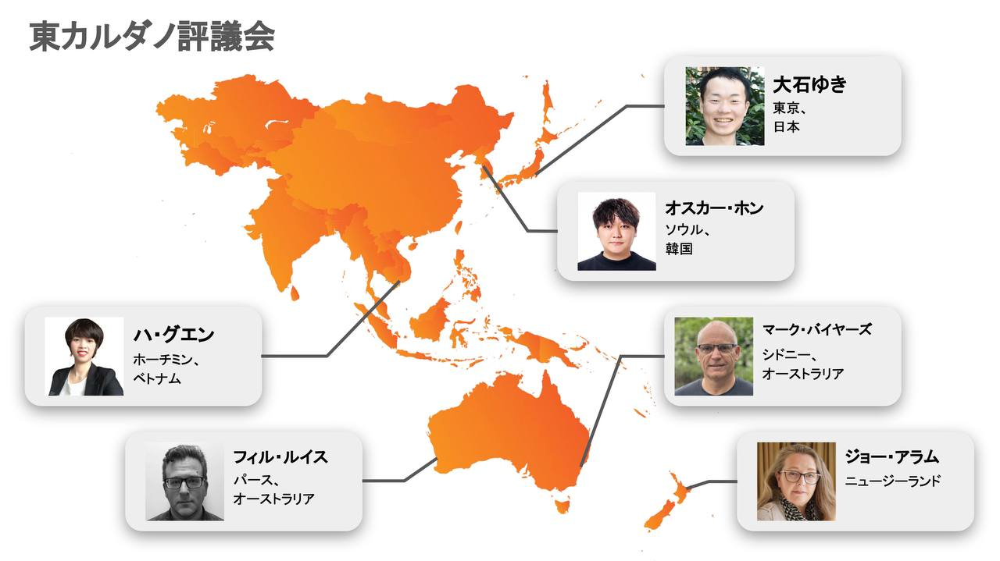
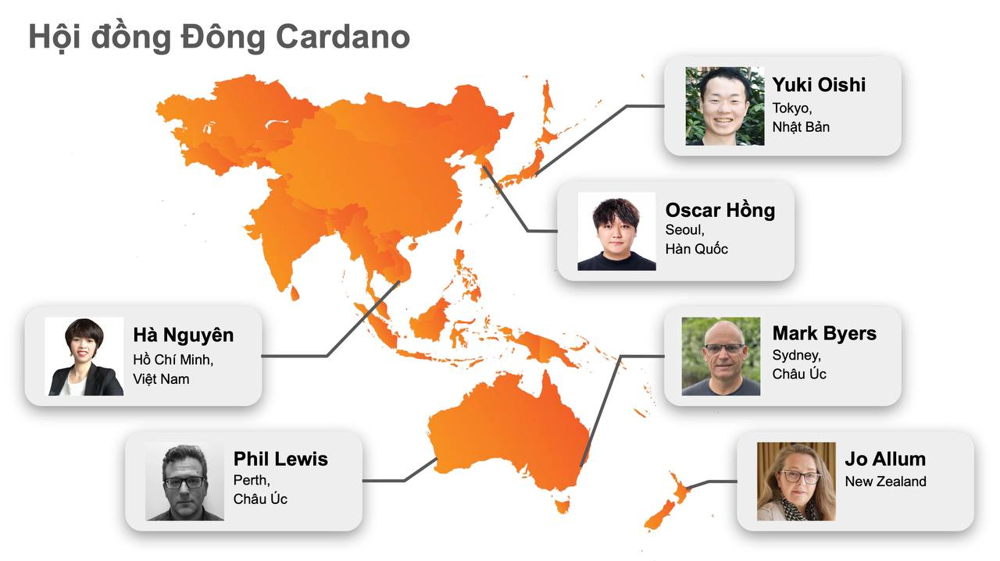

> <strong>This repository has moved to:</strong> [github.com/Eastern-Cardano-Council](https://github.com/Eastern-Cardano-Council)

# Cardano Eastern Council

> Also known as the Eastern Cardano Council

Information relating to the nomination for a seat on the Cardano Interim Constitutional Committee as the "[Eastern Cardano Council](https://intersect.gitbook.io/2024-constitutional-committee-members-election/candidates/eastern-cardano-council)".

[Member Profiles (PDF)](cicc-ec-member-profiles-1.0.0.pdf)

## Governance Framework
[Goverance Framework 1.0 (PDF)](https://github.com/selfdriven-foundation/cardano-eastern-council/blob/main/cicc-ec-goverance-framework-1.0.0.pdf)

Template:
[skillzeb.io/template-explorer/community-cardano-icc-ec](https://skillzeb.io/template-explorer/community-cardano-icc-ec)
>BLAKE2b-256 Hash: 8ec0b375cac9d32b8a1df095da3293f7e565fdbf7e2a290ab710005e02d9bc6c

## Registers
Template: [skillzeb.io/template-explorer/resource-cardano-icc-ec-registers](https://skillzeb.io/template-explorer/resource-cardano-icc-ec-registers)
>BLAKE2b-256 Hash: e34e460a2f0fed654e397f63ca141e95aea661d07fbcad06bbd47a6427550327

## Languages Spoken by Council Members
- English
- Japanese
- Korean
- Vietnamese

## Maps

<table>
    <tr>
        <td>
            
        </td>
        <td>
            
        </td>
    </tr>
    <tr>
        <td>
            
        </td>
        <td>
            
        </td>
    </tr>
</table>

## Notes
1. This repository is being hosted by the [selfdriven Foundation](https://selfdriven.foundation) as a community service.
2. The selfdriven Foundation itself is not a part of the Cardano Eastern Council.

## Shared As

- [CreativeCommons CC0 (Public Domain)](https://creativecommons.org/public-domain/cc0)

*#aaron*

